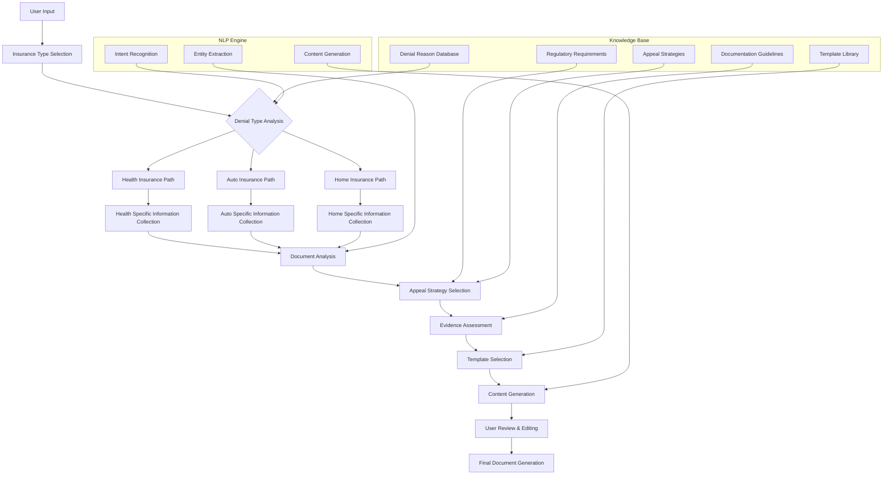

```mermaid
graph TD
    A[User Input] --> B[Insurance Type Selection]
    B --> C{Denial Type Analysis}
    C --> D1[Health Insurance Path]
    C --> D2[Auto Insurance Path]
    C --> D3[Home Insurance Path]
    
    D1 --> E1[Health Specific Information Collection]
    D2 --> E2[Auto Specific Information Collection]
    D3 --> E3[Home Specific Information Collection]
    
    E1 --> F[Document Analysis]
    E2 --> F
    E3 --> F
    
    F --> G[Appeal Strategy Selection]
    G --> H[Evidence Assessment]
    H --> I[Template Selection]
    I --> J[Content Generation]
    J --> K[User Review & Editing]
    K --> L[Final Document Generation]
    
    subgraph "Knowledge Base"
        KB1[Denial Reason Database]
        KB2[Regulatory Requirements]
        KB3[Appeal Strategies]
        KB4[Documentation Guidelines]
        KB5[Template Library]
    end
    
    KB1 --> C
    KB2 --> G
    KB3 --> G
    KB4 --> H
    KB5 --> I
    
    subgraph "NLP Engine"
        NLP1[Intent Recognition]
        NLP2[Entity Extraction]
        NLP3[Content Generation]
    end
    
    NLP1 --> C
    NLP2 --> F
    NLP3 --> J
```
